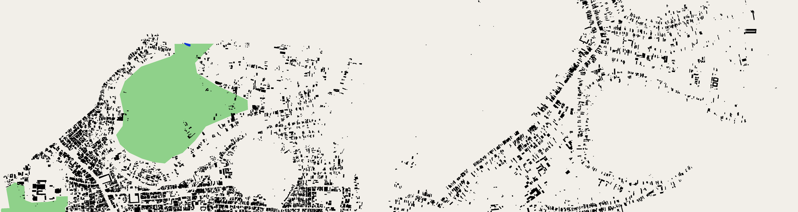
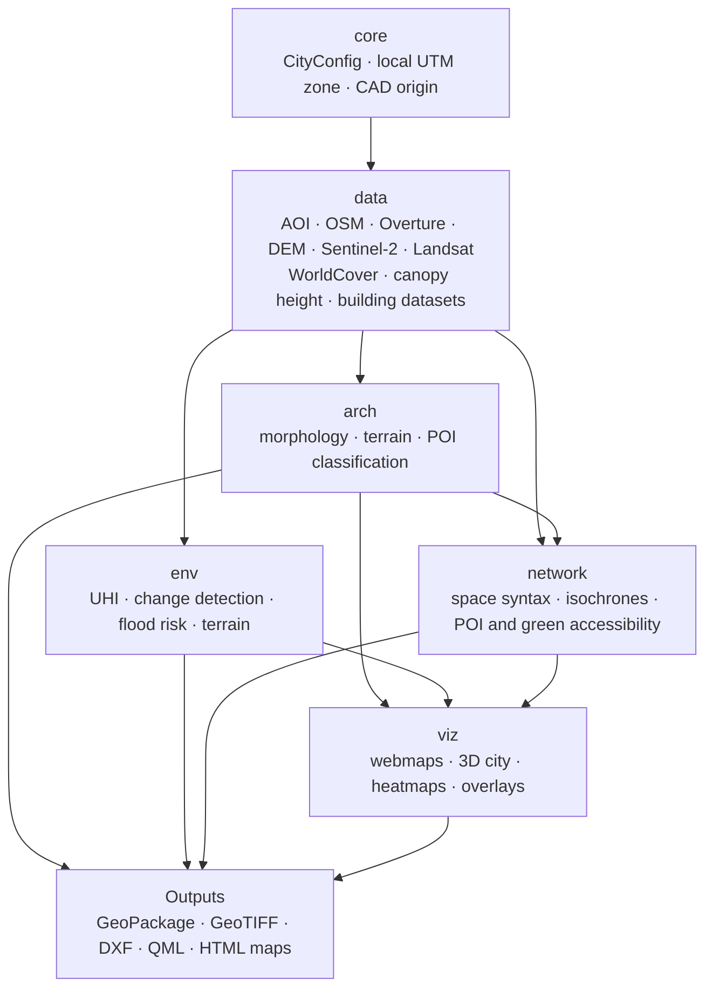

# SiteX



Open-data site analysis toolkit for urban design students working in **data-scarce
contexts**, for e.g. secondary cities in a developing country with no municipal GIS portal, no cadastral layer, no
official DTM. Extracted from a set of case-study notebooks built for Pleiku, Gia Lai,
Vietnam, and written to generalize to any geocodable place (Vietnam alone spans UTM
zones 48N and 49N, split at 108°E — a built-in stress test for anything hardcoding a
CRS).

The teaching notebooks that use this library are in a separate repository,
[ArchiColab/sitex-course](https://github.com/ArchiColab/sitex-course).

## Context of this work

SiteX was developed by Chau Nguyen as part of a master's thesis at Metropolia University
of Applied Sciences, in the Computing in Construction programme. It is also the
experimental case of the thesis: an **agentic system for spatial analysis**.

### Development approach: an agentic system with a human in the loop

In this thesis, an *agentic system* is a software system in which a large language model
is given a goal and a set of tools (here: reading and editing files, running Python and
GIS code) and decides its own next steps in a loop of acting, observing the result and
adjusting, instead of answering one prompt at a time.

The agent used here was Claude Code (Anthropic). It worked with a human in the loop: the
author defined the research questions, the workshop design, the analytical methods and
the data sources, reviewed and ran the agent's output, corrected it, and decided what
entered the library. Claude was a tool in this process and is not an author of the work.
Responsibility for the code, methods and results rests with the author. The method, its
limits and its evaluation are reported in the thesis.

## Install

SiteX needs Python 3.10 or newer and a geospatial stack (GDAL, PROJ) that is hard to
build with `pip` alone, especially on Windows. The recommended route is a conda
environment from [conda-forge](https://conda-forge.org/), using
[Miniforge](https://github.com/conda-forge/miniforge) or Anaconda.

```bash
git clone https://github.com/ArchiColab/sitex.git
cd sitex
conda env create -f environment.yml
conda activate sitex
```

This installs the compiled geospatial packages with conda and then SiteX with all its
extras with pip. Check that it works:

```bash
python -c "import sitex; print('ok')"
```

**Already have a working geo environment?** Install SiteX into it with pip. Each
analysis family has its own optional dependencies, so install only what you use:

```bash
pip install "sitex[network] @ git+https://github.com/ArchiColab/sitex.git"
```

Available extras: `data`, `arch`, `env`, `network`, `viz`, `dev`. The dependencies are
declared in `pyproject.toml`, so there is no separate `requirements.txt`.

**For the street network** (the Geofabrik route, see
[Data source decisions](#data-source-decisions)):
[`osmium-tool`](https://osmcode.org/osmium-tool/) is a command-line program, not a Python
package, so `pip` cannot install it and it is not in `pyproject.toml`. The conda
environment above includes it. In an existing environment, install it with
`conda install -c conda-forge osmium-tool`; in Google Colab, the notebook runs
`apt-get install osmium-tool` for you. Without it only the street download fails; the
other datasets are not affected.

## Architecture

SiteX is a set of small modules in four layers. One place description feeds all of them,
and the layers pass files (GeoPackage, GeoTIFF, GeoJSON) to each other rather than
objects, so a student can run any step on its own and open the result in QGIS or CAD.



| Package | Role | Main modules |
|---|---|---|
| `sitex.core` | Shared foundation | `config` (`CityConfig`), `geo` (UTM zone, CAD origin), `raster_viz`, `svg_charts`, `pipeline_diagram` |
| `sitex.data` | Acquisition of open data for one area of interest | `aoi`, `street_network`, `overture`, `remote_sensing` (DEM, Sentinel-2, Landsat), `landcover`, `canopy_height`, `gba`, `open_buildings` |
| `sitex.arch` | Buildings, ground and programme | `morphology`, `terrain` (contours, DXF), `poi_classification`, `poi_amenities` |
| `sitex.env` | Environmental analysis | `uhi`, `change_detection`, `flood_risk`, `terrain_env` |
| `sitex.network` | Street-network analysis and accessibility | `spacesyntax`, `isochrones`, `poi_accessibility`, `green_accessibility`, `street_edits`, `accessibility_common` |
| `sitex.viz` | Maps and scenes for discussion | `interactive_webmap`, `city3d`, `heatmaps`, `building_overlays`, `city_morphology_maps`, `raster_scenes`, `workshop_diagram` |

Design choices:

- **`CityConfig` is the single source of truth for a site.** It derives the local UTM
  zone, the CAD/UCS origin and a filename slug from a place name and a point, so no
  module hardcodes a CRS. Most functions have a `..._for_city()` wrapper that takes it.
- **No accounts where avoidable.** Global datasets are streamed by bounding box (DuckDB
  range requests on GeoParquet, GDAL `/vsicurl/` on cloud GeoTIFFs), so nothing large is
  downloaded first. Sentinel-2 through the Copernicus Data Space Ecosystem needs a free
  login.
- **Analysis and acquisition are separate.** `sitex.data` only downloads and saves;
  the other packages read the saved files.
- **Outputs are for design tools.** Results are written as files that open in QGIS
  and CAD (GeoPackage, GeoTIFF, DXF, QGIS style files), next to interactive HTML maps.

## Status

Extraction from the case-study notebooks is complete: all six packages above are in
place and covered by a test suite (`pytest`).

## Quickstart

```python
from sitex.core.config import CityConfig

pleiku = CityConfig(
    place_name="Phường Pleiku, Gia Lai, Vietnam",
    local_lat=13.98,
    local_lon=108.00,
)

pleiku.slug          # "phuong_pleiku"
pleiku.local_epsg    # 32649
pleiku.origin        # (easting, northing) CAD/UCS base point, floored to 1000 m
```

## Data source decisions

Two data sources were changed after the evaluation, and the reasons are recorded here so
that a reader of the notebooks knows why they differ from the first version.

**Elevation: Copernicus GLO-30 instead of NASADEM.** The first version used NASADEM as the
terrain model (DTM). A check on ten Vietnamese towns found negative heights in flat delta
land. In NASADEM up to 11.1% of the pixels of one place (Long Xuyên) were below 0 m, while
GLO-30 had at most 0.4% negative pixels in nine of the ten places. Where NASADEM was
negative it lay 3 to 12 m below GLO-30, which in flat land is similar in size to the
terrain's own relief. Where the terrain has relief, as on the Pleiku plateau, the two models agree
closely. The check compares two sources; it is not a validation against measured heights,
so neither model is ground truth. GLO-30 is used because it does not show this artefact.
It is downloaded through OpenTopography with the same API key as before, and the AW3D30
surface model is unchanged. The file is now `dem/dtm_glo30.tif` (before:
`dem/dtm_nasadem.tif`). A few modules and notebooks still mention or default to the old
file name, for example `arch.morphology` and the 3D Model notebook; they are switched one
module at a time.

**Streets: a Geofabrik extract instead of Overpass.** OSM streets used to be downloaded
from a public Overpass server through OSMnx. Those servers are shared services with rate
limits, and they can become unreachable: during testing, connections to `overpass-api.de`
timed out and its mirror `overpass.private.coffee` accepted connections but did not answer
within 180 s. Very large boundaries can also exceed what an Overpass server accepts in one
query. The course notebook therefore downloads the OSM extract of the whole country from
[Geofabrik](https://download.geofabrik.de/) once (for Vietnam about 330 MB, updated daily),
crops it to the boundary or, for a drawn rectangle, to its box with `osmium-tool`, and
builds the `drive`, `walk` and `drive_service` street graphs from the cropped file. After
the download no query depends on a server, and the size of the site does not matter.
The cost is the one large download, data that can be up to a day older than the live map,
and the extra program to install (see [Install](#install)). For an initial site analysis
this is sufficient. The Overpass function `download_street_networks` is still in
`sitex.data.street_network` next to `street_networks_from_geofabrik`. The Geofabrik route
was tested on one ward in Hà Nội with the full Vietnam file (download about 4.5 minutes,
crop and graphs a few seconds); it has not yet been compared with an Overpass result or
run in Google Colab.

## Data sources and licences

The MIT licence of this repository covers the **code only**. SiteX does not ship the
datasets; it downloads them at run time from their providers, and each dataset keeps its
own licence. Check the terms before you publish or reuse a result, and give the
attribution the provider asks for.

| Data | Module | Licence | Attribution / note |
|---|---|---|---|
| OpenStreetMap (streets, boundaries) | `data.aoi`, `data.street_network` | ODbL | © OpenStreetMap contributors |
| Overture Maps: buildings, base, transportation | `data.overture` | ODbL; buildings also include CC BY 4.0 sources | © OpenStreetMap contributors; Overture Maps Foundation |
| Overture Maps: places | `data.overture` | CDLA Permissive 2.0 (Foursquare part: Apache 2.0) | Overture Maps Foundation |
| Global Building Atlas | `data.gba` | Split: ODbL polygons; **CC BY-NC 4.0** for LoD1 models, height maps and some polygons | Zhu et al. (2025), *Earth System Science Data* 17(12), 6647–6668. Non-commercial terms apply |
| Open Buildings 2.5D Temporal (Google) | `data.open_buildings` | CC BY 4.0 or ODbL (your choice) | Sirko et al. (2023), arXiv:2310.11622 |
| High resolution canopy height (Meta, WRI) | `data.canopy_height` | CC BY 4.0 (as listed on the AWS registry for the 2024 release; confirm for the version you use) | Meta and WRI; source imagery © Maxar |
| ESA WorldCover 10 m 2021 | `data.landcover` | CC BY 4.0 | © ESA WorldCover project 2021 / Contains modified Copernicus Sentinel data (2021) processed by ESA WorldCover consortium |
| Sentinel-2 (Copernicus Data Space) | `data.remote_sensing` | Copernicus open data terms | Contains modified Copernicus Sentinel data |
| Landsat 8/9 Collection 2 Level-2 (Planetary Computer) | `data.remote_sensing` | USGS open data policy | Credit USGS/NASA Landsat |
| Copernicus DEM GLO-30 (DTM), via OpenTopography | `data.remote_sensing` | Copernicus DEM free licence | Produced using Copernicus WorldDEM-30 © DLR e.V. 2010-2014 and © Airbus Defence and Space GmbH 2014-2018 provided under COPERNICUS by the European Union and ESA; all rights reserved. The licence also asks for a liability notice when you distribute the data; read it at the provider |
| AW3D30 (DSM) | `data.remote_sensing` | JAXA terms of use | Read the JAXA terms before redistributing tiles |
| OpenStreetMap extract from Geofabrik (streets) | `data.street_network` | ODbL | © OpenStreetMap contributors; extracts by Geofabrik GmbH |

Licence details for these datasets were read from the providers' own pages, and
providers change them. The provider's page is the reference, not this table. If you
combine layers with different licences (for example ODbL and CC BY-NC), the combination
can carry the stricter terms, and that is your responsibility to check.

Space syntax functions in `sitex.network.spacesyntax` are adapted from Nabil Mohareb
(2024), The American University in Cairo (space-syntaxNM).

## Develop

```bash
pip install -e ".[dev]"
pytest
```

## Licence

Code: MIT, see [LICENSE](LICENSE).

## Citation

If you use SiteX, please cite the thesis it belongs to:

> Nguyen, C. (2026). *[Thesis title]*. Master's thesis, Metropolia University of Applied
> Sciences, Computing in Construction.
